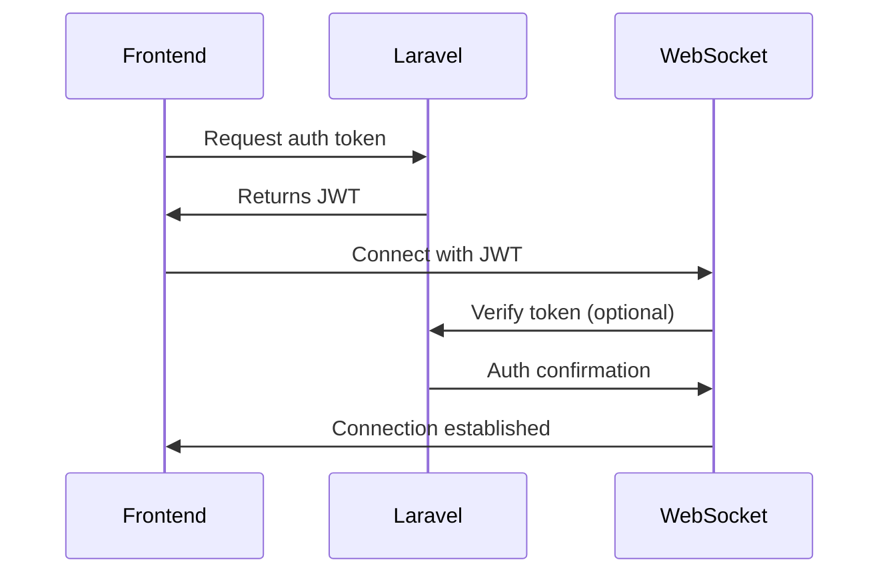

# WebSocket Notification System

A production-ready replacement for Pusher using Node.js/Socket.io with Laravel integration.

## 📦 Prerequisites

- PHP 8.1+
- Node.js 16+
- Redis 6+
- Laravel 9+
- Composer 2+

## 🚀 Installation

### 1. WebSocket Server Setup

```bash
# Clone the repository
git clone https://github.com/your-repo/websocket-server.git
cd websocket-server

# Install dependencies
npm install

# Copy environment file
cp .env.example .env

# Start the server (development)
npm run dev

# Production (with PM2)
npm install -g pm2
pm2 start src/server.js --name "websocket-server"
```

### 2. Laravel Configuration

```bash
# In your Laravel project
composer require guzzlehttp/guzzle

# Configure .env
BROADCAST_DRIVER=socket.io
SOCKETIO_SERVER=http://localhost:6001
SOCKETIO_SECRET=your-secret-key
QUEUE_CONNECTION=database # or redis
```

## 🌐 API Endpoints

### WebSocket Server API (HTTP)

| Endpoint | Method | Description | Headers | Payload |
|----------|--------|-------------|---------|---------|
| `/api/auth/token` | POST | Generate JWT | - | `{"userId": "123"}` |
| `/api/channels/broadcast` | POST | Broadcast event | `Authorization: Bearer <JWT>` | `{"channel": "orders", "event": "order.update", "data": {...}}` |
| `/api/notifications/send` | POST | Send to user | `Authorization: Bearer <JWT>` | `{"userId": "123", "event": "notification", "data": {...}}` |
| `/health` | GET | Server status | - | - |

### WebSocket Events

| Event | Direction | Payload | Description |
|-------|-----------|---------|-------------|
| `connect` | → | `{"token": "JWT"}` | Authenticate connection |
| `subscribe` | → | `{"channel": "private-orders"}` | Join channel |
| `notification` | ← | `{"title": "New order", ...}` | Received notification |

## 🔌 Laravel Integration

### Broadcasting Events

```php
// app/Events/OrderShipped.php
class OrderShipped implements ShouldBroadcast
{
    use Dispatchable, InteractsWithSockets;

    public function broadcastOn()
    {
        return new Channel('orders');
    }
}
```

### Sending Notifications

```php
// app/Notifications/InvoicePaid.php
class InvoicePaid extends Notification implements ShouldQueue
{
    use Queueable;

    public function via($notifiable)
    {
        return ['broadcast'];
    }

    public function toBroadcast($notifiable)
    {
        return [
            'title' => 'Invoice Paid',
            'amount' => $this->invoice->amount
        ];
    }
}
```

## 🛠️ Environment Variables

### WebSocket Server (.env)

```ini
PORT=6001
APP_SECRET=your-secret-key
REDIS_HOST=localhost
REDIS_PORT=6379
LARAVEL_URL=http://your-laravel-app.test
```

### Laravel (.env)

```ini
BROADCAST_DRIVER=socket.io
SOCKETIO_SERVER=http://localhost:6001
SOCKETIO_SECRET=your-secret-key
```

## 📡 Frontend Setup

```javascript
// resources/js/bootstrap.js
import Echo from 'laravel-echo';
import io from 'socket.io-client';

window.Echo = new Echo({
    broadcaster: 'socket.io',
    host: process.env.MIX_SOCKETIO_SERVER,
    transports: ['websocket']
});

// Listen for events
window.Echo.channel('orders')
    .listen('OrderShipped', (data) => {
        console.log('Order shipped:', data);
    });
```

## 🔒 Authentication Flow



## 🧪 Testing

1. Start WebSocket server: `npm run dev`
2. Run Laravel queue worker: `php artisan queue:work`
3. Trigger test event:
```bash
php artisan tinker
>>> event(new App\Events\OrderShipped());
```

## 🚨 Troubleshooting

| Issue | Solution |
|-------|----------|
| Connection refused | Verify WebSocket server is running |
| 403 Forbidden | Check JWT secret matches in both servers |
| No events received | Verify channel subscriptions |
| Redis errors | Ensure Redis server is running |

## 📜 License

##### MIT
